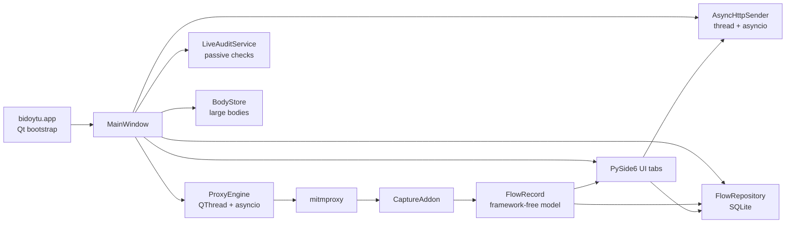
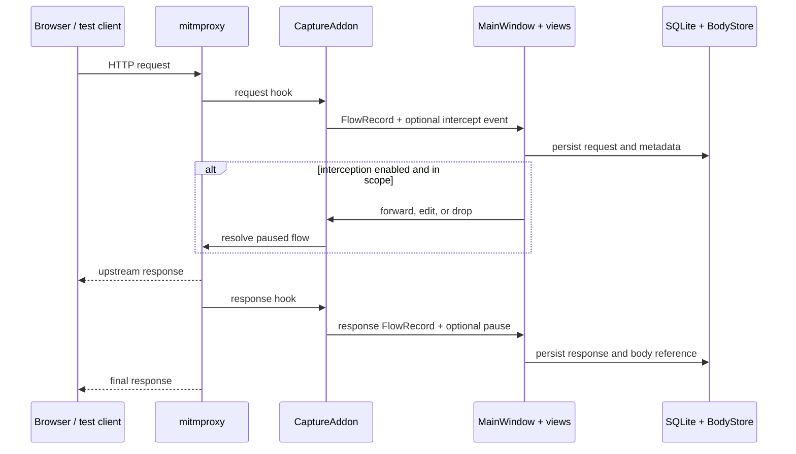

# Bidoytu documentation

> A focused desktop HTTP interception and testing workspace for authorized security work.

Bidoytu is a Python desktop application for inspecting, modifying, and replaying HTTP traffic through a local [mitmproxy](https://mitmproxy.org/) engine. It brings live history, request and response interception, Repeater workflows, an Intruder foundation, and an out-of-band Collaborator workflow into one PySide6 interface.

This page is the application wiki: it is intended to give users, contributors, and maintainers one reliable map of how Bidoytu works and where to find the implementation.

## At a glance

| Area | What it provides |
| --- | --- |
| Proxy | Local HTTP/HTTPS interception, target scope, start/stop controls, and CA export |
| History | Searchable SQLite-backed request/response history with filters, metadata, and body storage |
| Intercept | Pause, inspect, edit, forward, or drop in-scope requests and responses |
| Repeater | Manually edit and resend requests with asynchronous HTTP execution |
| Intruder | Automated request attacks with positions, payloads, concurrency, and cancellation |
| Collaborator | Interactsh registration, payload generation, and out-of-band interaction polling |
| Workspaces | Isolated per-session data, saved tool state, and portable session export |
| Delivery | Windows/Linux PyInstaller artifacts and tagged PyPI releases through CI |

## Contents

- [Getting started](#getting-started)
- [First-run workflow](#first-run-workflow)
- [Feature guide](#feature-guide)
- [How the application is put together](#how-the-application-is-put-together)
- [Request and response data flow](#request-and-response-data-flow)
- [Data and storage](#data-and-storage)
- [Configuration](#configuration)
- [Testing and development](#testing-and-development)
- [Packaging and releases](#packaging-and-releases)
- [Security and responsible use](#security-and-responsible-use)
- [Repository map](#repository-map)

## Getting started

### Requirements

- Python 3.11 or newer
- Windows or Linux
- Network access for proxy targets and optional Interactsh use

### Install from source

```powershell
python -m venv .venv
.venv\Scripts\Activate.ps1
python -m pip install -e .
bidoytu
```

On Linux, activate the environment with `source .venv/bin/activate` and run the same install command. The module entry point is also available as `python -m bidoytu`.

The runtime dependencies are [PySide6](https://pypi.org/project/PySide6/), [mitmproxy](https://pypi.org/project/mitmproxy/), [httpx](https://pypi.org/project/httpx/), and [cryptography](https://pypi.org/project/cryptography/). Optional development dependencies add PyInstaller, Nuitka, build, and twine tooling.

## First-run workflow

1. Launch Bidoytu and choose or create a workspace.
2. The main window opens on the **Proxy** tab and starts the local proxy automatically.
3. Configure the listener if needed. The safe default is `127.0.0.1:8080`.
4. Configure include/exclude host scope before enabling interception.
5. Point a browser, test client, or device that you control at the proxy.
6. For HTTPS, export the public CA certificate from **Proxy → CA Certificate** and trust it only on an authorized machine.
7. Review captured traffic in **History**, or enable **Intercept** to pause traffic for editing.
8. Send a request to **Repeater** or **Intruder** for focused testing.
9. Save the workspace when closing, or export all sessions as a portable `.bidoytu.zip` archive.

If the listener port is unavailable, Bidoytu reports the conflict and offers to retry, change the port, or cancel. The proxy runs only after the listener has successfully bound.

## Feature guide

### Proxy

The Proxy tab owns listener configuration, target scope, CA certificate export, and the two operational views: **History** and **Intercept**.

- Requests and completed responses are captured as framework-independent `FlowRecord` objects.
- Scope affects interception eligibility and the scope classification shown in History. History retains out-of-scope traffic so it can still be reviewed and filtered.
- HTTP/2 support is enabled by default through `ProxyConfig.http2`.
- The proxy is isolated in a `QThread` with its own asyncio event loop; Qt widgets never run inside the mitmproxy loop.

Implementation: [`proxy/engine.py`](../src/bidoytu/proxy/engine.py), [`proxy/capture_addon.py`](../src/bidoytu/proxy/capture_addon.py), and [`config.py`](../src/bidoytu/config.py).

### Target

Target configuration is a dedicated top-level workspace, separate from HTTP History. It supports include/exclude host rules, path prefixes, regular-expression rules, reusable presets, and a sitemap inventory. Rules are persisted per workspace and apply immediately to interception and history scope classification; exclusions take precedence.

### History

History is the durable record of captured traffic. It supports filtering, saved filters, detail inspection, metadata such as tags/notes/bookmarks, duplicate marking, and sending requests to other tools.

Large bodies are transparently moved out of the database into the body store. The UI hydrates them only when an editor or detail view needs the content.

Implementation: [`ui/history_view.py`](../src/bidoytu/ui/history_view.py), [`ui/flow_table_model.py`](../src/bidoytu/ui/flow_table_model.py), [`storage/repository.py`](../src/bidoytu/storage/repository.py), and [`storage/advanced_history.py`](../src/bidoytu/storage/advanced_history.py).

### Intercept

Request interception is enabled from the Intercept view. For an in-scope flow, the proxy pauses the flow on its event loop until the UI resolves it:

- **Forward**: continue unchanged.
- **Forward with edits**: parse the edited raw request or response and apply the method, path/status, headers, and body.
- **Drop**: kill the flow.
- **Intercept response**: pause all in-scope responses or arm a one-shot response pause for a selected request.

Disabling interception releases currently paused requests and responses so the proxy does not leave traffic suspended.

Implementation: [`ui/intercept_view.py`](../src/bidoytu/ui/intercept_view.py) and [`proxy/capture_addon.py`](../src/bidoytu/proxy/capture_addon.py).

### Repeater

Repeater provides persistent request/response sessions for manual experimentation. Requests can be loaded from History or Intercept, edited as raw HTTP, and sent with the shared asynchronous sender.

The sender uses `httpx.AsyncClient` instances on a dedicated thread and supports:

- per-request TLS verification;
- optional redirect following;
- cancellation through `SendHandle`;
- pooled connections or a fresh client for separate-connection sends;
- response timing and structured error/cancellation results.

Implementation: [`ui/repeater_tab.py`](../src/bidoytu/ui/repeater_tab.py), [`ui/repeater_session.py`](../src/bidoytu/ui/repeater_session.py), and [`net/async_sender.py`](../src/bidoytu/net/async_sender.py).

### Intruder

Intruder is the automated attack surface. A request can be loaded from History or Intercept, positions can be marked in the request editor, and payloads can be applied through an attack runner. Results are modeled separately from the editor so an attack can be cancelled and reviewed without blocking the Qt event loop.

Implementation: [`ui/intruder_tab.py`](../src/bidoytu/ui/intruder_tab.py), [`ui/intruder_session.py`](../src/bidoytu/ui/intruder_session.py), and [`ui/attack_runner.py`](../src/bidoytu/ui/attack_runner.py).

### Live audit

Live audit is an opt-in, passive review of in-scope traffic already flowing
through the proxy. It never sends probes, follows links, starts browser
automation, or modifies traffic. The tab separates Summary, Audit items, and
Issues; selecting an issue opens its advisory, the captured request and
response, and the path from observed evidence to the finding. Evidence matches
are highlighted in the appropriate message pane.

The initial detector set covers transport and browser-security headers, CSP,
cookie attributes, CORS policy, cache directives, technology disclosure,
sensitive URL parameters, verbose errors, directory listings, password form
autocomplete, and mixed-content references. Findings are review items based on
captured evidence, not proof that an issue is exploitable.

An adjacent active-verification switch can replay only in-scope GET, HEAD, and
OPTIONS requests through a bounded worker. It uses a unique reflection marker
and a diagnostic quote to identify candidates for reflected XSS and SQL error
handling. State-changing methods are skipped to avoid turning a live audit into
an unreviewed mutation workflow. This is intentionally narrower than Burp's
full active scanner; Scrapy/Playwright workers will remain a separate future
opt-in subsystem.

Implementation: [`audit/service.py`](../src/bidoytu/audit/service.py),
[`ui/audit_tab.py`](../src/bidoytu/ui/audit_tab.py), and
[`ui/audit_model.py`](../src/bidoytu/ui/audit_model.py).

The **Vulnerability catalog** sub-section mirrors the six entries currently
listed in PortSwigger's Scanner catalog: XSS, SQL injection, CSRF, XXE,
directory traversal, and SSRF. Each local advisory includes aliases, summary,
impact, detection guidance, prevention, current Bidoytu coverage, and a link
to the full PortSwigger reference. The catalog is a reference view; it does
not imply that every entry is automatically confirmed by the live scanner.

### Collaborator

Collaborator integrates with an Interactsh-compatible out-of-band service. The tab manages registration and polling, displays received interactions, and provides fresh payload hosts to Repeater and Intruder request editors.

After registration, one payload is automatically created and copied to the
clipboard. Use **New payload** when a separate hostname is needed; bulk payload
generation is intentionally avoided to keep the workflow simple.

Polling is guarded against overlapping requests and the session is refreshed with
keep-alive registration. If a session expires, the tab attempts to register a new
session automatically. HTTPS registration is used by default; HTTP fallback must
be explicitly enabled for a trusted self-hosted server. Saved Windows sessions
use the current user's DPAPI protection for the private key and token.

The interaction table supports DNS, HTTP(S), SMTP, LDAP, FTP, SMB, and Responder
filters. Exports include the original interaction metadata, raw request/response,
payload label, and request-context note.

Use this feature only with an approved server and an authorized test target. A Collaborator payload is intentionally treated as external content and should not be placed into production traffic without explicit authorization.

Implementation: [`ui/collaborator_tab.py`](../src/bidoytu/ui/collaborator_tab.py) and [`net/interactsh.py`](../src/bidoytu/net/interactsh.py).

### Display and themes

Raw HTTP is parsed and formatted for display without changing the underlying captured bytes. JSON, XML/HTML, and URL-encoded bodies receive display-only formatting. The application supports persisted light and dark themes, including matching syntax highlighting for raw-message views.

Implementation: [`http_utils.py`](../src/bidoytu/http_utils.py) and [`ui/theme.py`](../src/bidoytu/ui/theme.py).

## How the application is put together



The important boundary is `FlowRecord`. It contains request/response metadata and body references without depending on Qt or mitmproxy types. That makes it suitable for thread handoff, persistence, table models, editors, and tool-to-tool actions.

### Startup sequence

`bidoytu.app:main()` creates the QApplication, applies the saved theme, opens the workspace picker, constructs an `AppConfig` rooted at the selected workspace, then creates `MainWindow`. The window initializes storage and background services, restores saved sessions and tool state, and starts the proxy after the window is visible.

### Threading model

| Execution context | Responsibility |
| --- | --- |
| Qt UI thread | Widgets, models, signals/slots, user decisions |
| Proxy thread + asyncio loop | mitmproxy server, capture hooks, paused-flow events |
| Sender thread + asyncio loop | Repeater/Intruder HTTP requests via httpx |
| Storage calls | SQLite and body-store persistence coordinated by `MainWindow` |

Cross-thread control enters the proxy loop through `loop.call_soon_threadsafe`. Background request results are delivered through callbacks and then marshalled into the owning Qt widget's signal flow.

## Request and response data flow



The request is recorded before interception, which means the History view can represent paused requests. The response is surfaced to the intercept panel before persistence so an oversized body can still be displayed from its inline representation while the UI decides what to do.

## Data and storage

Each workspace has a predictable data root. `AppConfig` places the database, large bodies, mitmproxy CA material, and serialized tool state beneath that root.

| Data | Purpose |
| --- | --- |
| SQLite database | Flow metadata, saved filters, notes, tags, and history indexes |
| Body store | File-backed request/response bodies above the inline-size threshold |
| `ca/` | mitmproxy CA and generated certificate material |
| Repeater state | Restored request/response sessions |
| Intruder state | Last attack configuration |
| Collaborator state | Registration/session information for restoration |
| Theme state | Saved light/dark preference |

`FlowRecord` stores either a body inline or a relative body-store path. The repository assigns the SQLite row id, while `flow_id` preserves mitmproxy correlation. On close, the application saves widget-owned state, stops the proxy and sender, closes the repository, and either keeps or discards the selected workspace.

## Configuration

The default data directory is:

| Platform | Default location |
| --- | --- |
| Windows | `%LOCALAPPDATA%\Bidoytu` |
| Linux/macOS | `$XDG_DATA_HOME/bidoytu`, or `~/.local/share/bidoytu` |

Important proxy settings include listener host/port, HTTP/2, include scope, and exclude scope. Scope entries are normalized as host patterns: schemes, paths, and ports are removed, and leading `*.` / `.` prefixes are handled consistently.

Implementation: [`config.py`](../src/bidoytu/config.py) and [`workspace.py`](../src/bidoytu/workspace.py).

## Testing and development

### Fast verification

```bash
python -m compileall -q src
python scripts/smoke_test.py
```

Run focused live scripts when changing proxy, interception, response handling, compression, ports, or CA behavior:

- `scripts/proxy_live_test.py`
- `scripts/intercept_live_test.py`
- `scripts/intercept_response_live_test.py`
- `scripts/repeater_live_test.py`
- `scripts/gzip_decode_test.py`
- `scripts/port_conflict_test.py`
- `scripts/ca_export_test.py`

The live scripts use `QT_QPA_PLATFORM=offscreen` where appropriate and may require network access. Keep changes Qt-isolated: non-UI layers should remain free of widget dependencies.

### Contribution workflow

Development changes are integrated through `staging`. Create feature branches from the current staging branch and open pull requests against staging. Reserve `main` for reviewed, release-ready changes. See [`CONTRIBUTING.md`](../CONTRIBUTING.md) for repository expectations.

## Packaging and releases

The release workflow builds Windows and Linux artifacts with PyInstaller from [`packaging/bidoytu.spec`](../packaging/bidoytu.spec). The CI workflow builds both platforms in parallel:

| Trigger | Result |
| --- | --- |
| Push to `main` | Rolling `latest` pre-release |
| Push of a `v*` tag | Permanent versioned GitHub release |
| Versioned tag | Also publishes the package to PyPI through Trusted Publishing |

To cut a release, update the version in both `pyproject.toml` and `src/bidoytu/__init__.py`, commit and push the change, then create and push the matching tag. Local builds use:

```bash
pip install -e ".[dev]"
python -m PyInstaller packaging/bidoytu.spec --noconfirm
```

The spec intentionally excludes unused Qt modules such as QtWebEngine to keep the bundle smaller. If a future feature needs an excluded module, update the spec and verify the resulting artifact on both operating systems.

See [`packaging/build_release.md`](../packaging/build_release.md) for the complete release procedure.

## Security and responsible use

Bidoytu can decrypt, read, and modify traffic after a CA is trusted. Use it only against systems and traffic you own or are explicitly authorized to test.

The most important operational safeguards are:

- Keep the listener on `127.0.0.1` unless broader binding is deliberate and protected.
- Treat the CA private key and `.p12` bundles as secrets. Export only the public certificate.
- Remove the trusted CA when testing is complete.
- Protect the workspace: captured traffic is stored unencrypted and may contain credentials, cookies, tokens, and other sensitive data.
- Do not paste captured secrets into issues, logs, or third-party services.
- Report suspected vulnerabilities privately rather than opening a public issue.

Read [`SECURITY.md`](../SECURITY.md) for the full policy, supported-version guidance, CA handling rules, and reporting process.

## Repository map

```text
src/bidoytu/
├── app.py                 Qt application bootstrap and workspace selection
├── config.py              Data paths, proxy settings, scope, and limits
├── workspace.py           Workspace lifecycle and archive export/discard
├── http_utils.py          HTTP parsing, rebuilding, and display helpers
├── net/
│   ├── async_sender.py    Repeater/Intruder HTTP client service
│   └── interactsh.py      Collaborator/Interactsh client
├── proxy/
│   ├── engine.py          mitmproxy thread and UI-facing signals
│   └── capture_addon.py   Flow capture and interception hooks
├── storage/
│   ├── models.py          Framework-free FlowRecord model
│   ├── repository.py      SQLite persistence and history queries
│   ├── body_store.py      Large-body file storage
│   └── advanced_history.py Filters and history export helpers
├── ui/                    Main window, tabs, editors, views, and models
└── assets/                Packaged icons and logos
scripts/                   Smoke checks and focused live verification
packaging/                 PyInstaller spec and release documentation
```

### Source of truth

This wiki describes the current implementation. When behavior changes, update the relevant source documentation and this page together.
